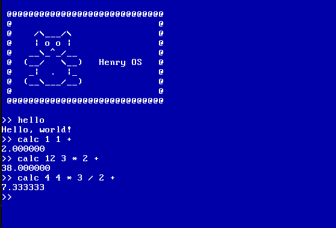

# Henry OS

Henry OS is a basic X86 operating system built from first principles for research and educational purposes.

It provides a more sophisticated and useful 'bare bones' implementation for prototyping advanced OS concepts and ideas.

## Features

+ Integrates GNU GRUB / multiboot for reaching (32-bit) protected mode from real mode.
+ Builds the OS into an ISO that works in QEMU.
+ GDT, IDT, and PIC implementations using X86 ASM and C.
+ A scrolling terminal implementation with keyboard input.
+ Functional software interrupts, e.g. use `int` in X86 ASM.
+ Hardware IRQs: see `keyboard.c`
+ A mini C stdlib.
+ A built-in reverse Polish notation calculator via `calc`
+ Works in QEMU.

## Usage

1. Clone the repo.
2. Get [i686-elf-tools](https://github.com/lordmilko/i686-elf-tools) up and running.
3. Run `make` to build Henry OS, then `make run` to run it in QEMU.
4. Make your own changes and have fun!

Disclaimer: this project has only been tested under QEMU.

## Notes

+ After `make run`, QEMU runs the ISO, which uses GNU GRUB to run our multiboot image made from `src/boot.asm`.
+ `boot.asm` calls `kmain()` in `src/kernel.c`.
+ The IDT, PIC, and terminal are initialised before enabling interrupts.
+ The OS loops until it receives user input via the keyboard.

## Credits

+ The [OSDev.org](https://osdev.org) community.
+ The [OpenBSD](www.openbsd.org) project.